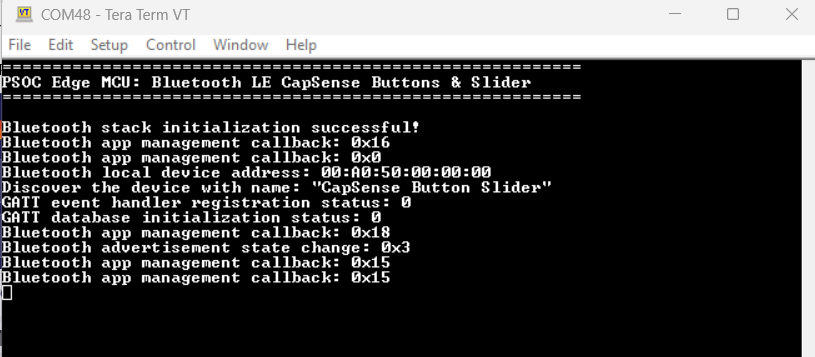
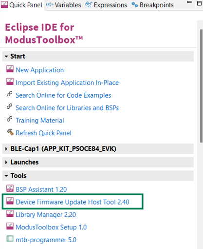
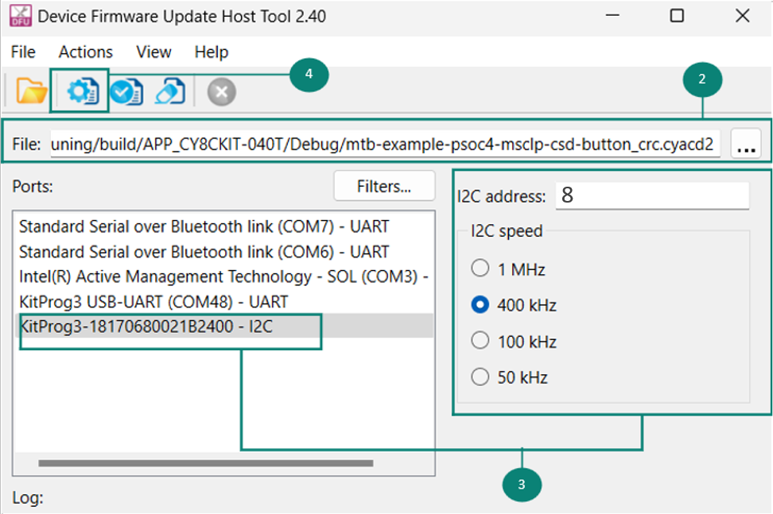
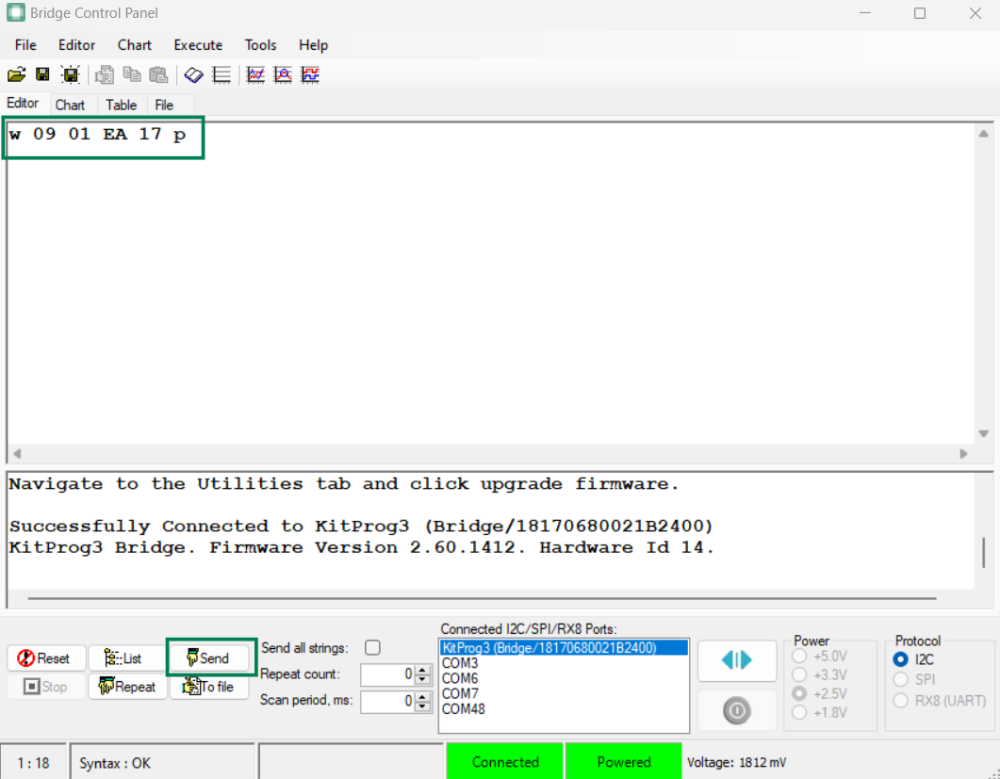

# PSOC&trade; Edge MCU: BLE with CAPSENSE&trade; buttons and slider

This code example demonstrates a Bluetooth&reg; LE GATT Server implemented using PSOC&trade; Edge E84 MCU with AIROC&trade; CYW55513 Wi-Fi & Bluetooth&reg; combo chip with a 5-segment linear slider and two CAPSENSE&trade; buttons. The buttons control the LED, with one turning it on and the other turning it off, while the slider adjusts the LED's brightness. The button states and slider data are transmitted to the GATT Client via GATT notifications. The code example leverages a PSOC&trade; 4000T CAPSENSE&trade; MCU, located on the same system-on-module (SoM) as the PSOC&trade; Edge E84 MCU to detect button presses and slider movements. The CAPSENSE&trade; chip processes the data, which is then read by the PSOC&trade; Edge E84 using the I2C protocol.

This code example has a three project structure: CM33 secure, CM33 non-secure, and CM55 projects. All three projects are programmed to the external QSPI flash and executed in Execute in Place (XIP) mode. Extended boot launches the CM33 secure project from a fixed location in the external flash, which then configures the protection settings and launches the CM33 non-secure application. Additionally, CM33 non-secure application enables CM55 CPU and launches the CM55 application.

[View this README on GitHub.](https://github.com/Infineon/mtb-example-psoc-edge-btstack-capsense-buttons-slider)

[Provide feedback on this code example.](https://cypress.co1.qualtrics.com/jfe/form/SV_1NTns53sK2yiljn?Q_EED=eyJVbmlxdWUgRG9jIElkIjoiQ0UyNDA0NjEiLCJTcGVjIE51bWJlciI6IjAwMi00MDQ2MSIsIkRvYyBUaXRsZSI6IlBTT0MmdHJhZGU7IEVkZ2UgTUNVOiBCTEUgd2l0aCBDQVBTRU5TRSZ0cmFkZTsgYnV0dG9ucyBhbmQgc2xpZGVyIiwicmlkIjoic3VyZXNoa3VtYXJhIiwiRG9jIHZlcnNpb24iOiIyLjAuMCIsIkRvYyBMYW5ndWFnZSI6IkVuZ2xpc2giLCJEb2MgRGl2aXNpb24iOiJNQ0QiLCJEb2MgQlUiOiJJQ1ciLCJEb2MgRmFtaWx5IjoiUFNPQyJ9)

See the [Design and implementation](docs/design_and_implementation.md) for the functional description of this code example.

> **Note**: This code example requires you to first program the PSOC&trade; 4000T CAPSENSE&trade; MCU with the provided *.cyacd2* file using the DFU Host Tool before programming the PSOC&trade; Edge E84 MCU.


## Requirements

- [ModusToolbox&trade;](https://www.infineon.com/modustoolbox) v3.6 or later (tested with v3.6)
- Board support package (BSP) minimum required version: 1.0.0
- Programming language: C
- Associated parts: All [PSOC&trade; Edge MCU](https://www.infineon.com/products/microcontroller/32-bit-psoc-arm-cortex/32-bit-psoc-edge-arm) parts


## Supported toolchains (make variable 'TOOLCHAIN')

- GNU Arm&reg; Embedded Compiler v14.2.1 (`GCC_ARM`) – Default value of `TOOLCHAIN`
- Arm&reg; Compiler v6.22 (`ARM`)
- IAR C/C++ Compiler v9.50.2 (`IAR`)
- LLVM Embedded Toolchain for Arm&reg; v19.1.5 (`LLVM_ARM`)


## Supported kits (make variable 'TARGET')

- [PSOC&trade; Edge E84 Evaluation Kit](https://www.infineon.com/KIT_PSE84_EVAL) (`KIT_PSE84_EVAL_EPC2`) – Default value of `TARGET`
- [PSOC&trade; Edge E84 Evaluation Kit](https://www.infineon.com/KIT_PSE84_EVAL) (`KIT_PSE84_EVAL_EPC4`)


## Hardware setup

This example uses the board's default configuration. See the kit user guide to ensure that the board is configured correctly.

Ensure the following jumper and pin configuration on board.
- BOOT SW must be in the HIGH/ON position
- J20 and J21 must be in the tristate/not connected (NC) position


## Software setup

See the [ModusToolbox&trade; tools package installation guide](https://www.infineon.com/ModusToolboxInstallguide) for information about installing and configuring the tools package.

Install a terminal emulator if you do not have one. Instructions in this document use [Tera Term](https://teratermproject.github.io/index-en.html).

Download and install the AIROC&trade; Bluetooth&reg; Connect App on your [iOS](https://apps.apple.com/in/app/airoc-bluetooth-connect-app/id6443702288) or [Android](https://play.google.com/store/apps/details?id=com.infineon.airocbluetoothconnect) phone.

Scan the following QR codes from your mobile phone to download the AIROC&trade; Bluetooth&reg; Connect App.


This example requires no additional software or tools.


## Operation

See [Using the code example](docs/using_the_code_example.md) for instructions on creating a project, opening it in various supported IDEs, and performing tasks, such as building, programming, and debugging the application within the respective IDEs.

1. Connect the board to your PC using the provided USB cable through the KitProg3 USB connector

2. Program the PSOC&trade; 4000T CAPSENSE&trade; device by following the [Program a PSOC&trade; 4000T device using DFU Host Tool](#program-a-psoc-4000t-device-using-the-dfu-host-tool) section

   > **Note:** Once you program the application on a PSOC&trade; 4000T CAPSENSE&trade; device, the program counter switches from bootloader to the application. If you need to program the PSOC&trade; 4000T CAPSENSE&trade; device using DFU Host Tool again, reset the program counter to the bootloader mode, allowing it to receive and install the new application. See the instructions provided in the [Switching to the bootloader from the application on a PSOC&trade; 4000T CAPSENSE&trade; device](#switch-to-the-bootloader-from-the-application-on-a-psoc-4000t-capsense-device) section to switch back to bootloader

3. Open a terminal program and select the KitProg3 COM port. Set the serial port parameters to 8N1 and 115200 baud

4. After programming, the application starts automatically. Observe the messages on the UART terminal and wait for the device to make all the required connections. Use the KitProg3 COM port to view the Bluetooth&reg; stack and application trace messages in the terminal window as shown in **Figure 1**

   **Figure 1. Log messages on KitProg3 COM port**

   

5. To test the application, touch the CAPSENSE&trade; Button 0 (BTN0) to turn the LED ON, touch Button 1 (BTN1) to turn the LED OFF, and touch the slider in different positions to change the brightness

6. To test using the AIROC&trade; Bluetooth&reg; Connect App, do the following (see the equivalent AIROC&trade; Bluetooth&reg; Connect App screenshots in **Figure 2** and **Figure 3**):

    1. Turn ON Bluetooth&reg; and Location on your Android or iOS device

    2. Launch the AIROC&trade; Bluetooth&reg; Connect App

    3. The LED2 starts blinking once you program the application indicating that advertisement has started. Advertising will stop after 90 seconds if a connection has not been established

    4. Swipe down on the AIROC&trade; Bluetooth&reg; Connect App home screen to start scanning for Bluetooth&reg; LE Peripheral devices. Your device named "CAPSENSE&trade; Button Slider" displays in the AIROC&trade; Bluetooth&reg; Connect App home screen. Select your device to establish a Bluetooth&reg; LE connection

       Two services are shown in the AIROC&trade; Bluetooth&reg; Connect carousel view

    6. Tap on the **CAPSENSE&trade; Slider** profile from the services. Touch the slider and change its position on the board. It changes the slider graphic pattern on the app screen. Additionally, the brightness of the LED changes based on the slider position

    7. Tap on the **CAPSENSE&trade; Buttons** profile from the services. Touch Button 0 (BTN0) and Button 1 (BTN1) on the board to change the button graphic on the app screen; the LED status toggles ON/OFF

       **Figure 2** and **Figure 3** show the steps for using the AIROC&trade; Bluetooth&reg; Connect App on iOS and Android respectively

       **Figure 2. Testing with the AIROC&trade; Bluetooth&reg; Connect App on iOS**

       


       **Figure 3. Testing with the AIROC&trade; Bluetooth&reg; Connect App on Android**

       


## Program a PSOC&trade; 4000T device using the DFU Host Tool

> **Note:** Ensure to erase the existing application on the PSOC&trade; Edge E84 MCU by following [Steps to erase the application on PSOC&trade; Edge E84 MCU](#erase-the-application-on-psoc-edge-e84-mcu) section if the existing application uses the default I2C lines (P8_0 and P8_1) before following these steps. This should be implemented to ensure that no other I2C communication is happening via the same I2C lines connected between the PSOC&trade; Edge E84 MCU and PSOC&trade; 4000T CAPSENSE&trade; MCU.

Before programming the main application to the PSOC&trade; Edge E84 MCU, program the PSOC&trade; 4000T CAPSENSE&trade; device, which is present on the PSOC&trade; Edge E84 MCU SOM. The PSOC&trade; Edge E84 Evaluation Kit has an onboard KitProg, which acts as the USB-to-I2C bridge and it is connected to the I2C bus of the PSOC&trade; 4000T device. Therefore, program the PSOC&trade; 4000T CAPSENSE&trade; device via the I2C lines connected to the KitProg using the DFU Host Tool.

Follow these steps for programming the PSOC&trade; 4000T using the DFU Host Tool. 

1. Open Device Firmware Update Host Tool from the Quick Panel as shown in **Figure 4** or search for DFU Configurator Tool from the Search Panel

   **Figure 4. Open DFU Host Tool**

   

2. Select the *psoc4-csd-button-slider.cyacd2* file provided along with the code example

3. Select the KitProg3 - I2C port from the list of **Ports** and provide the **I2C address** as **8** and select the **I2C Speed** as **400 kHz**. Ensure that no other serial terminal or port is opened. Here `0x08` is the I2C address provided in the bootloader

4. Click on **Program** icon to program the *.cyacd2* file into the PSOC&trade; 4000T CAPSENSE&trade; chip

   **Figure 5** shows the steps 2, 3, and 4 

   **Figure 5. Program the application using DFU Host Tool**

   


## Switch to the bootloader from the application on a PSOC&trade; 4000T CAPSENSE&trade; device

> **Note:** Ensure to erase the existing application on the PSOC&trade; Edge E84 MCU by following [Erase the application on PSOC&trade; Edge E84 MCU](#erase-the-application-on-psoc-edge-e84-mcu) section if the application uses the default I2C lines (P8_0 and P8_1) before following these steps. This should be implemented to ensure that no other I2C communication is happening via the same I2C lines connected between the PSOC&trade; Edge E84 MCU and PSOC&trade; 4000T CAPSENSE&trade; MCU.

Dynamic switching between the bootloader and the application is triggered by sending commands over I2C.

To send the commands, a USB-to-I2C bridge and a I2C serial terminal software like **Bridge Control Panel** (BCP) is used. BCP is included with the installation of [PSOC&trade; Programmer](https://softwaretools.infineon.com/tools/com.ifx.tb.tool.psocprogrammer). The PSOC&trade; Edge E84 Evaluation kit has an onboard KitProg, which acts as the USB-to-I2C bridge and it is connected to the I2C bus of the PSOC&trade; 4000T device.

To switch to the bootloader while the application is running, follow these steps: 

1. Open Bridge Control Panel and select the KitProg3 port from the "Connected I2C/SPI/Rx8 Ports tab
2. Select I2C from the Protocol tab
3. Enter the below command and click the send button 

   > **Note:** `0x09` is the I2C address provided in the application to switch back to the bootloader<br>

   ```
   w 09 01 EA 17 p
   ```
   
   **Figure 6. BCP command**  

   


## Erase the application on PSOC&trade; Edge E84 MCU

1. Open the erase_app/common.sh file and modify the below details,
      - CM33_AP_SN=100D0F5102122400 . Update with the serial number of the device connected. To get the serial number of the connected device, Open modus-shell application ({ModusToolbox™ install directory}/tools_<version>/modus-shell/Cygwin.bat) and use the below command in Modus Shell.

        ```
         fw-loader --device-list
        ```
2. Make sure the path to the OpenOCD is correctly mentioned in the erase_app/common.sh file. 

3. Open modus-shell application ({ModusToolbox™ install directory}/tools_<version>/modus-shell/Cygwin.bat) and navigate to the application_folder/erase_app and run the erase_smif.sh by entering `./erase_smif_epc2.sh` or `./erase_smif_epc4.sh` based on the BSP chosen to erase existing application in PSOC&trade; Edge MCU.


## Related resources

Resources  | Links
-----------|----------------------------------
Application notes  | [AN235935](https://www.infineon.com/AN235935) – Getting started with PSOC&trade; Edge E8 MCU on ModusToolbox&trade; software <br> [AN236697](https://www.infineon.com/AN236697) – Getting started with PSOC&trade; MCU and AIROC&trade; Connectivity devices
Code examples  | [Using ModusToolbox&trade;](https://github.com/Infineon/Code-Examples-for-ModusToolbox-Software) on GitHub
Device documentation | [PSOC&trade; Edge MCU datasheets](https://www.infineon.com/products/microcontroller/32-bit-psoc-arm-cortex/32-bit-psoc-edge-arm#documents) <br> [PSOC&trade; Edge MCU reference manuals](https://www.infineon.com/products/microcontroller/32-bit-psoc-arm-cortex/32-bit-psoc-edge-arm#documents)
Development kits | Select your kits from the [Evaluation board finder](https://www.infineon.com/cms/en/design-support/finder-selection-tools/product-finder/evaluation-board)
Libraries  | [mtb-dsl-pse8xxgp](https://github.com/Infineon/mtb-dsl-pse8xxgp) – Device support library for PSE8XXGP <br> [retarget-io](https://github.com/Infineon/retarget-io) – Utility library to retarget STDIO messages to a UART port <br> [btstack-integration](https://github.com/Infineon/btstack-integration) – The btstack-integration hosts platform adaptation layer (porting layer) between AIROC&trade; BTSTACK and Infineon's different hardware platforms
Tools  | [ModusToolbox&trade;](https://www.infineon.com/modustoolbox) – ModusToolbox&trade; software is a collection of easy-to-use libraries and tools enabling rapid development with Infineon MCUs for applications ranging from wireless and cloud-connected systems, edge AI/ML, embedded sense and control, to wired USB connectivity using PSOC&trade; Industrial/IoT MCUs, AIROC&trade; Wi-Fi and Bluetooth&reg; connectivity devices, XMC&trade; Industrial MCUs, and EZ-USB&trade;/EZ-PD&trade; wired connectivity controllers. ModusToolbox&trade; incorporates a comprehensive set of BSPs, HAL, libraries, configuration tools, and provides support for industry-standard IDEs to fast-track your embedded application development

<br>


## Other resources

Infineon provides a wealth of data at [www.infineon.com](https://www.infineon.com) to help you select the right device, and quickly and effectively integrate it into your design.


## Document history

Document title: *CE240461* – *PSOC&trade; Edge MCU: Bluetooth&reg; LE with CAPSENSE&trade; buttons and slider*

 Version | Description of change
 ------- | ---------------------
 1.x.0   | New code example <br> Early access release
 2.0.0   | GitHub release
<br>


All referenced product or service names and trademarks are the property of their respective owners.

The Bluetooth&reg; word mark and logos are registered trademarks owned by Bluetooth SIG, Inc., and any use of such marks by Infineon is under license.

PSOC&trade;, formerly known as PSoC&trade;, is a trademark of Infineon Technologies. Any references to PSoC&trade; in this document or others shall be deemed to refer to PSOC&trade;.

---------------------------------------------------------

© Cypress Semiconductor Corporation, 2023-2025. This document is the property of Cypress Semiconductor Corporation, an Infineon Technologies company, and its affiliates ("Cypress").  This document, including any software or firmware included or referenced in this document ("Software"), is owned by Cypress under the intellectual property laws and treaties of the United States and other countries worldwide.  Cypress reserves all rights under such laws and treaties and does not, except as specifically stated in this paragraph, grant any license under its patents, copyrights, trademarks, or other intellectual property rights.  If the Software is not accompanied by a license agreement and you do not otherwise have a written agreement with Cypress governing the use of the Software, then Cypress hereby grants you a personal, non-exclusive, nontransferable license (without the right to sublicense) (1) under its copyright rights in the Software (a) for Software provided in source code form, to modify and reproduce the Software solely for use with Cypress hardware products, only internally within your organization, and (b) to distribute the Software in binary code form externally to end users (either directly or indirectly through resellers and distributors), solely for use on Cypress hardware product units, and (2) under those claims of Cypress's patents that are infringed by the Software (as provided by Cypress, unmodified) to make, use, distribute, and import the Software solely for use with Cypress hardware products.  Any other use, reproduction, modification, translation, or compilation of the Software is prohibited.
<br>
TO THE EXTENT PERMITTED BY APPLICABLE LAW, CYPRESS MAKES NO WARRANTY OF ANY KIND, EXPRESS OR IMPLIED, WITH REGARD TO THIS DOCUMENT OR ANY SOFTWARE OR ACCOMPANYING HARDWARE, INCLUDING, BUT NOT LIMITED TO, THE IMPLIED WARRANTIES OF MERCHANTABILITY AND FITNESS FOR A PARTICULAR PURPOSE.  No computing device can be absolutely secure.  Therefore, despite security measures implemented in Cypress hardware or software products, Cypress shall have no liability arising out of any security breach, such as unauthorized access to or use of a Cypress product. CYPRESS DOES NOT REPRESENT, WARRANT, OR GUARANTEE THAT CYPRESS PRODUCTS, OR SYSTEMS CREATED USING CYPRESS PRODUCTS, WILL BE FREE FROM CORRUPTION, ATTACK, VIRUSES, INTERFERENCE, HACKING, DATA LOSS OR THEFT, OR OTHER SECURITY INTRUSION (collectively, "Security Breach").  Cypress disclaims any liability relating to any Security Breach, and you shall and hereby do release Cypress from any claim, damage, or other liability arising from any Security Breach.  In addition, the products described in these materials may contain design defects or errors known as errata which may cause the product to deviate from published specifications. To the extent permitted by applicable law, Cypress reserves the right to make changes to this document without further notice. Cypress does not assume any liability arising out of the application or use of any product or circuit described in this document. Any information provided in this document, including any sample design information or programming code, is provided only for reference purposes.  It is the responsibility of the user of this document to properly design, program, and test the functionality and safety of any application made of this information and any resulting product.  "High-Risk Device" means any device or system whose failure could cause personal injury, death, or property damage.  Examples of High-Risk Devices are weapons, nuclear installations, surgical implants, and other medical devices.  "Critical Component" means any component of a High-Risk Device whose failure to perform can be reasonably expected to cause, directly or indirectly, the failure of the High-Risk Device, or to affect its safety or effectiveness.  Cypress is not liable, in whole or in part, and you shall and hereby do release Cypress from any claim, damage, or other liability arising from any use of a Cypress product as a Critical Component in a High-Risk Device. You shall indemnify and hold Cypress, including its affiliates, and its directors, officers, employees, agents, distributors, and assigns harmless from and against all claims, costs, damages, and expenses, arising out of any claim, including claims for product liability, personal injury or death, or property damage arising from any use of a Cypress product as a Critical Component in a High-Risk Device. Cypress products are not intended or authorized for use as a Critical Component in any High-Risk Device except to the limited extent that (i) Cypress's published data sheet for the product explicitly states Cypress has qualified the product for use in a specific High-Risk Device, or (ii) Cypress has given you advance written authorization to use the product as a Critical Component in the specific High-Risk Device and you have signed a separate indemnification agreement.
<br>
Cypress, the Cypress logo, and combinations thereof, ModusToolbox, PSoC, CAPSENSE, EZ-USB, F-RAM, and TRAVEO are trademarks or registered trademarks of Cypress or a subsidiary of Cypress in the United States or in other countries. For a more complete list of Cypress trademarks, visit www.infineon.com. Other names and brands may be claimed as property of their respective owners.