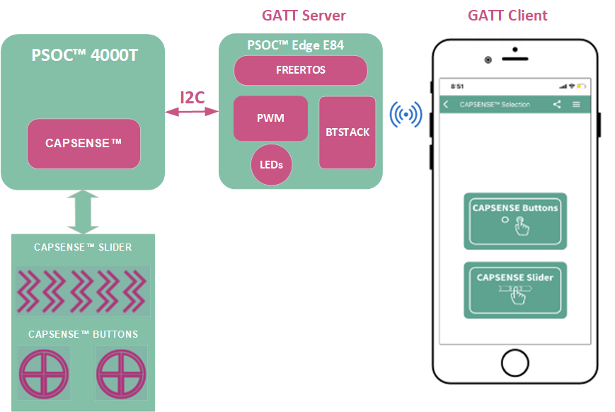

[Click here](../README.md) to view the README.

## Design and implementation

The design of this application is minimalistic to get started with code examples on PSOC&trade; Edge MCU devices. All PSOC&trade; Edge E84 MCU applications have a dual-CPU three-project structure to develop code for the CM33 and CM55 cores. The CM33 core has two separate projects for the secure processing environment (SPE) and non-secure processing environment (NSPE). A project folder consists of various subfolders, each denoting a specific aspect of the project. The three project folders are as follows:

**Table 1. Application projects**

Project | Description
--------|------------------------
*proj_cm33_s* | Project for CM33 secure processing environment (SPE)
*proj_cm33_ns* | Project for CM33 non-secure processing environment (NSPE)
*proj_cm55* | CM55 project

 

In this code example, at device reset, the secure boot process starts from the ROM boot with the secure enclave (SE) as the root of trust (RoT). From the secure enclave, the boot flow is passed on to the system CPU subsystem where the secure CM33 application starts. After all necessary secure configurations, the flow is passed on to the non-secure CM33 application. Resource initialization for this example is performed by this CM33 non-secure project. It configures the system clocks, pins, clock to peripheral connections, and other platform resources. It then enables the CM55 core using the `Cy_SysEnableCM55()` function and the CM55 core is subsequently put to DeepSleep mode.

In the CM33 non-secure application, the clocks and system resources are initialized by the BSP initialization function. The retarget-io is initialized to use the debug UART port and user LEDs are initialized and controlled using the timer, counter pulse width modulation (TCPWM) block, and then Bluetooth&reg; LE stack is initialized.

The firmware uses FreeRTOS to execute the tasks required by this application, and then the following tasks are created and executed:

- **I2C_CAPSENSE&trade; task:** Initializes the I2C master. Reads the CAPSENSE&trade; buttons and slider status, and then the data from the PSOC&trade; 4000T CAPSENSE&trade; chip, which is configured as an EZI2C Slave. Based on the button and slider data, the LED command is sent over a queue to the board task and the task notification is sent to the Bluetooth&reg; LE task

- **Board task:** Initializes the TCPWM in PWM mode for driving the LED and updates the status of the LED based on the received command

- **Bluetooth&reg; LE task:** Initializes the Bluetooth&reg; stack and GATT services, and sends the CAPSENSE&trade; buttons and slider values to the client via notifications

This code example makes use of the PSOC&trade; 4000T CAPSENSE&trade; MCU, which is present on the same system-on-module (SoM) as the PSOC&trade; Edge E84 MCU to obtain the CAPSENSE&trade; buttons and slider status using the CAPSENSE&trade; middleware library.

The PSOC&trade; 4000T CAPSENSE&trade; MCU is set up as an EZI2C Slave, with two EZI2C buffers configured:
- The first buffer, with an I2C address of '0x08' is used to update CAPSENSE&trade; data, which is read from the PSOC&trade; Edge E84 MCU (I2C master)

- The second buffer, with an I2C address of '0x09' contains the logic to switch to the bootloader from the application, based on commands received in the buffer using the Bridge Control Panel

**Figure 1. CAPSENSE&trade; buttons and slider implementation**

